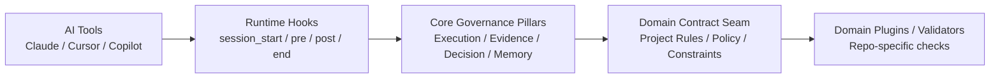

# AI Governance Framework

把 AI Coding 任務從「黑箱輸出」變成「可驗證流程」的治理框架。

當你用 Claude / Cursor / Copilot 讓 AI 幫你改程式時，最常見的問題不是「有沒有產生結果」，而是：
- 結果是否符合專案規則
- 過程是否留有可審核證據
- reviewer 是否能一致判斷可不可以接受

它做的事情很直接：
**在任務開始前讀規則、執行前後做檢查、結束後產生可交接證據，讓 reviewer 有資料可判斷。**

---

## 1) 這個框架會做什麼（What It Does）

每次任務會固定經過四個階段：
1. `session_start`：建立治理上下文（規則、契約、記憶、狀態）
2. `pre_task_check`：執行前檢查前提、風險、政策邊界
3. `post_task_check`：執行後驗證輸出、證據、契約一致性
4. `session_end`：產生可審核 artifact 與 reviewer handoff

### 治理如何進入 AI 決策迴圈（5 層）


---

## 2) Quick Start（2 分鐘）

### 安裝
```bash
pip install -r requirements.txt
```

### 跑最小 smoke
```bash
python governance_tools/quickstart_smoke.py --project-root . --plan PLAN.md --contract examples/usb-hub-contract/contract.yaml --format human
```

### 預期輸出（示意）
```text
[session_start] ✓ context loaded from PLAN.md
[pre_task_check] ✓ contract validated
[post_task_check] ✓ evidence artifacts generated
[session_end] ✓ reviewer handoff written
PASS — governance pipeline functional
```

### 驗證治理是否漂移
```bash
python governance_tools/governance_drift_checker.py --repo . --framework-root .
```

---

## 3) 輸出範例（綠燈 / 紅燈）

### 綠燈（可進 reviewer 判讀）
```json
{
  "ok": true,
  "decision_usage_allowed": false,
  "analysis_safe_for_decision": false,
  "verdict": "review_required",
  "violations": []
}
```

### 紅燈（治理攔截）
```json
{
  "ok": false,
  "verdict": "blocked",
  "failure_code": "contract_violation",
  "violations": [
    {
      "rule": "no_direct_db_access_from_handler",
      "location": "src/handlers/user.py:42",
      "detail": "AI agent attempted to call db.execute() directly; project contract requires repository layer"
    }
  ],
  "remediation": "refactor to use UserRepository.find_by_id() per governance/RULE_REGISTRY.md"
}
```

### Token 觀測（輔助上下文，不是決策）
```json
{
  "token_observability_level": "step_level",
  "token_source_summary": "mixed(provider, estimated)",
  "provenance_warning": "mixed_sources",
  "decision_usage_allowed": false
}
```

延伸示範（Before/After）：  
- [docs/demo/before-after.md](docs/demo/before-after.md)

---

## 4) Use Cases / Not For

### 適用
- 想把 AI 產出納入可審核流程的團隊
- 多 repo 需要共用治理基線（adoption / drift / readiness）
- 需要 reviewer handoff 與證據鏈的工程流程

### 不適用
- 想要自動代替人類做最終決策的系統
- 想拿它當 correctness proof 或 full regression 替代品
- 想把 token 訊號直接拿去做 gating/scoring/ranking

---

## 5) 導入到你的 Repo（Adopt）

```bash
python governance_tools/adopt_governance.py --target /path/to/your/repo
```

執行後通常會：
- 建立 `governance/`（例如 `AGENT.md`, `SYSTEM_PROMPT.md`, `RULE_REGISTRY.md`）
- 建立 `runtime_hooks/`（session start/pre/post/end 生命週期檢查）
- 建立 `.governance-state.yaml`（治理狀態追蹤）
- 建立 `AGENTS.md` 與 `PLAN.md`（AI 工作入口與任務規劃）

不會直接修改：
- 你的 `src/` 或核心業務邏輯目錄
- 你的專案依賴檔（除非你選擇 full adopt 路徑）

下一步請看：
- [docs/consuming-repo-adoption-checklist.md](docs/consuming-repo-adoption-checklist.md)
- [examples/starter-pack/](examples/starter-pack/)
- [governance_tools/upgrade_starter_pack.py](governance_tools/upgrade_starter_pack.py)

---

## 6) Architecture Deep Dive

### Runtime Hooks
- [runtime_hooks/core/session_start.py](runtime_hooks/core/session_start.py)
- [runtime_hooks/core/pre_task_check.py](runtime_hooks/core/pre_task_check.py)
- [runtime_hooks/core/post_task_check.py](runtime_hooks/core/post_task_check.py)
- [runtime_hooks/core/session_end.py](runtime_hooks/core/session_end.py)

### Governance Tools
- [governance_tools/adopt_governance.py](governance_tools/adopt_governance.py)
- [governance_tools/governance_drift_checker.py](governance_tools/governance_drift_checker.py)
- [governance_tools/external_repo_readiness.py](governance_tools/external_repo_readiness.py)
- [governance_tools/upgrade_starter_pack.py](governance_tools/upgrade_starter_pack.py)

### Canonical Source
- [governance/AGENT.md](governance/AGENT.md)
- [governance/SYSTEM_PROMPT.md](governance/SYSTEM_PROMPT.md)
- [governance/TESTING.md](governance/TESTING.md)
- [governance/ARCHITECTURE.md](governance/ARCHITECTURE.md)
- [governance/RULE_REGISTRY.md](governance/RULE_REGISTRY.md)

### Reviewer Surface
- [docs/status/README.md](docs/status/README.md)
- [docs/status/runtime-governance-status.md](docs/status/runtime-governance-status.md)
- [docs/status/trust-signal-dashboard.md](docs/status/trust-signal-dashboard.md)
- [docs/status/reviewer-handoff.md](docs/status/reviewer-handoff.md)

---

## 7) Limitations / Non-claims

本框架目前**不宣稱**：
- full regression coverage
- token correctness guarantee
- production readiness guarantee
- automated misuse enforcement
- runtime decision safety authorization

---

## 8) 目前迭代狀態

目前迭代狀態（含 Token controlled slice closeout）已移至：
- [docs/status/current-iteration.md](docs/status/current-iteration.md)

---

## 9) Versioning

- 穩定發布資訊請以 [CHANGELOG.md](CHANGELOG.md) 為準。
- `main` 可能包含尚未標記 release 的最新治理改進。

---

## 10) Contributing / License

- License: [Apache 2.0](LICENSE)
- Releases: [docs/releases/README.md](docs/releases/README.md)
