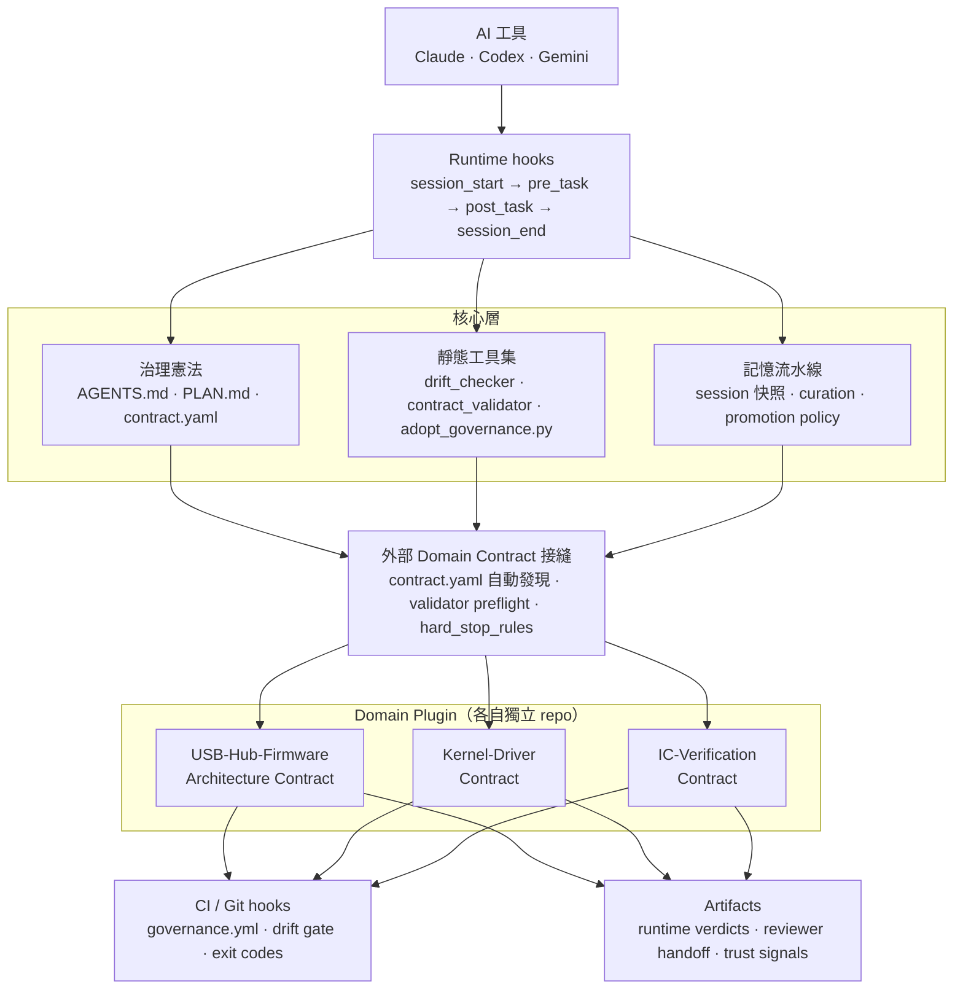

# AI Governance Framework

> 一個可執行的 AI 治理運行時框架，面向多 repo 工程協作流程，現階段已完成真實 repo 驗證，並持續收斂採用摩擦、語義驗證深度與 CI / hook 攔截覆蓋率。

[](CHANGELOG.md)
[](http://makeapullrequest.com)

## 目前定位

這個 repo 仍然可以準確描述為一個 AI governance framework，但它已經不只是
prompt / 規則包裝層，也不只是靜態政策文件集合。

目前比較準確、且有邊界的描述是：

- 一個面向 AI-assisted development 的 machine-interpretable governance runtime
- 具備可執行的 decision boundary、可審查的 artifact，以及 state-aware 的 session governance
- 橫跨 execution、evidence、decision、memory / state、reviewer surface

目前已經成立的能力：

- 真正可執行的 runtime loop：
  `session_start -> pre_task_check -> post_task_check -> session_end`
- 帶有 decision context 的 verdict / trace / session artifact
- reviewer-visible 的 advisory semantics，可降低誤讀但不擴張 verdict authority
- 可被檢視的 execution / state integrity signal，而不是隱藏的 prompt 政策來源

目前**不主張**的範圍：

- 完整的 execution harness
- machine-authoritative 的 advisory system
- 通用型 multi-agent orchestration platform
- 在所有 tool surface 上都已達成 full agent-ready determinism

## 為什麼用這個框架

大多數 AI 協作工作流的崩壞方式其實很像，不是模型本身不夠強，而是沒有機制在跨 session 之間維持一致性：

- AI 忘記你前幾天做過的決策
- 它逐漸偏離目前的 sprint 或 phase
- 它越過了本來不該碰的架構邊界
- 它做完事情卻沒留下任何可審查的知識或 artifact

這個 repo 的核心不是再多寫幾份政策文件，而是提供一條可執行的治理運行時主幹，讓治理真的發生在每次 AI session 的邊界上：

`AI -> runtime governance -> task execution -> session lifecycle -> memory governance`

它目前的定位可以精準描述成：

- 一個已在真實 repo 跑過的 `AI Coding Runtime Governance Framework`
- 一個有實際 runtime governance spine 的框架，而不只是靜態治理文件集合
- 一個已驗證外部 domain validator seam 的治理系統，現有 firmware、kernel-driver、IC-verification slice
- 一套可跨平台採用的治理引入工具鏈，核心入口是 `adopt_governance.py`
- 一個帶有 16 項具名檢查與 minimum-legal schema 參考的 drift 檢測基線

仍在持續補強的面向包括：

- 語義驗證深度
- 實務上的 git hook / CI gate 攔截覆蓋率
- 不同 repo 類型下的規則分級，降低最小 repo 的治理負擔

## 完整技術文件

如果你想看完整的系統說明、8 大法典、runtime hooks、靜態工具集、memory pipeline、external domain seam、CI 整合與採用細節，請直接看：

- [docs/technical-overview.zh-TW.md](docs/technical-overview.zh-TW.md)

## 架構總覽



## 你實際能拿到什麼

### 1. 會自我治理的 Session 生命週期

`runtime_hooks/` 提供：

- `session_start`
- `pre_task_check`
- `post_task_check`
- `session_end`
- Claude / Codex / Gemini adapter
- 可落地到 `artifacts/runtime/` 的 verdict 與 trace artifact

`session_start` 會在 AI 動手前載入 PLAN 與 contract。`pre_task_check` 會依規則與風險等級做 gate。`post_task_check` 會在輸出落地前驗證結果。`session_end` 會把本次 session 寫成可審查 artifact，讓下一個 session 可以接續。

這套 runtime loop 是真的可運作的，但攔截覆蓋率尚未完全封閉；某些 IDE、local edit、直接 commit 路徑仍可能繞過它。

### 2. 能抓到真實問題的 Drift 偵測

`governance_tools/` 提供 contract validation、drift checking、readiness / onboarding、payload audit、reviewer handoff、release / trust surface 與 domain-specific evidence tooling。

關鍵入口包括：

- `adopt_governance.py`
- `governance_drift_checker.py`
- `external_repo_readiness.py`
- `external_repo_onboarding_report.py`
- `trust_signal_overview.py`
- `reviewer_handoff_summary.py`

目前 drift checker 有 16 項具名檢查，涵蓋：

- placeholder token 偵測
- 模板逐字複製防護
- section inventory 過時
- `AGENTS.md` 未填寫檢查

全部都能輸出機器可讀結果與 exit code，CI 可直接用來 block。

### 3. 可插拔的 Domain Contract 接縫

框架目前支援：

- `contract.yaml` discovery
- external rule root
- validator preflight
- validator execution
- `hard_stop_rules` 的 contract-level policy input
- 具版本相容性的 validator payload envelope

這是目前的 transitional seam，還不是最終決策架構；最終 verdict、violation handling 與 fallback 行為正逐步收斂進 runtime decision model。

目前已驗證的外部 domain slice 包括：

- `USB-Hub-Firmware-Architecture-Contract`
- `Kernel-Driver-Contract`
- `IC-Verification-Contract`

為了降低採用摩擦，runtime hooks 已支援 contract auto-discovery 與 summary-first domain loading。`kernel-driver` 路徑目前會載入 [docs/domain-summaries/kernel-driver-adapter-summary.md](docs/domain-summaries/kernel-driver-adapter-summary.md) 作為 live low-token adapter。

### 4. 記憶治理流水線

`memory_pipeline/` 支援：

- session snapshot
- memory curation
- promotion policy
- memory promotion
- 將 domain contract metadata 保留到 curated artifact

這讓 AI session 不只是「做完任務」，而是能把可追溯知識往下一個 session 帶過去。

### 5. 決策模型與 Rule Pack

內建 rule pack 包括：

- scope pack: `common`, `refactor`
- language pack: `python`, `cpp`, `csharp`, `swift`
- framework pack: `avalonia`
- platform pack: `kernel-driver`

下一階段 runtime 收斂方向見：

- [docs/governance-runtime-v2.6.md](docs/governance-runtime-v2.6.md)
- [governance/governance_decision_model.v2.6.json](governance/governance_decision_model.v2.6.json)

該決策模型定義了 ownership、policy precedence、evidence trust、violation handling 與 determinism contract，可被機器檢查。

## 它不嘗試做的事

這個框架治理的是 task 與 session 邊界，不是在模型 token generation 內部做全面管制。它不：

- 在 IDE 層攔截每一個 agent action
- 取代 fine-tuning 或模型層級 alignment
- 強制實作企業級 RBAC 或完整存取控制

如果你要的是 per-action sandbox，這不是它的目標。
如果你要的是跨多 repo 工作流的 session 邊界治理，這正是它要解的問題。

## 當前狀態

目前 release-facing 狀態：

- 正式 release-facing 版本：`v1.1.0`（2026-03-22）
- release note: [docs/releases/v1.1.0.md](docs/releases/v1.1.0.md)
- previous release: [docs/releases/v1.0.0-alpha.md](docs/releases/v1.0.0-alpha.md)
- changelog: [CHANGELOG.md](CHANGELOG.md)
- known limits: [docs/LIMITATIONS.md](docs/LIMITATIONS.md)
- status index: [docs/status/README.md](docs/status/README.md)
- trust signal dashboard: [docs/status/trust-signal-dashboard.md](docs/status/trust-signal-dashboard.md)
- domain enforcement matrix: [docs/status/domain-enforcement-matrix.md](docs/status/domain-enforcement-matrix.md)
- schema reference: [docs/minimum-legal-schema.md](docs/minimum-legal-schema.md)

補充說明：

- 目前正式對外 release-facing 狀態仍以 `v1.1.0` 為準。
- `main` 分支在此之後已累積多個 post-release hardening、runtime、adoption、advisory 相關改動，但尚未整理成新的正式 release note。
- 因此：
  - `docs/releases/v1.1.0.md` 代表最後一個正式對外發版狀態
  - `README.md` 與 `docs/status/` 反映的是目前主分支較新的能力邊界與進度

這個框架已適合做評估、內部採用試點與 domain-contract 實驗，但仍應視為 early-stage framework，而不是一個已完全封閉的 enforcement platform。語義驗證深度、採用平滑度與規則分級仍是持續開發面向。

### v1.1.0 與近期改動

- **Cross-platform adopt toolchain**：`adopt_governance.py` 取代 bash-only 的 `init-governance.sh`，Windows 可直接採用，且在目標 repo 缺少時會補最小 drift CI workflow
- **Schema visibility**：adopt 會把 repo slug 與當日日期寫入模板、修補必要的 `AGENTS.base.md` seam，並指出 `AGENTS.md` 仍維持模板 `N/A` 的欄位
- **16-check drift checker**：placeholder、template-copy guard、inventory staleness、`AGENTS.md` fill check 已成為命名基線的一部分
- **Freshness threshold**：framework 預設閾值提高到 14 天；contract 層 override 仍可在 drift 輸出中被審計，且 override 大於 14 天時會警示
- **Framework root auto-discovery**：`GOVERNANCE_FRAMEWORK_ROOT` 與 upward scan 已在 Python 工具與 bash 腳本上對齊
- **Minimum legal schema reference**：[docs/minimum-legal-schema.md](docs/minimum-legal-schema.md) 已被放到多個 onboarding 觸點
- **Current test count**：截至 Step 7 token-optimization roadmap 結束，現有 `1,333 tests`
- **Recent hardening**：onboarding 有獨立 audit lane；Windows terminal output 更安全；`kernel-driver-adapter-summary.md` 已作為 summary-first contract loading 的實際入口

## 驗證狀態

| 已驗證項目 | 狀態 |
|------------|------|
| 核心治理工具通過自動化測試套件（`1,333 tests`） | Done |
| Runtime hooks 可跨 Claude / Codex / Gemini adapter 運作 | Done |
| 外部 domain contract seam（firmware / kernel-driver / IC-verification） | Done |
| CI pipeline 可在每次 push 執行 governance checks | Done |
| Quickstart smoke 可在 5 分鐘內重現 | Done |
| 真實 repo 採用流程已在多種 repo 類型驗證 | Done |
| 空 repo 經 adopt 後可達到 drift-clean 或 repo-specific-follow-up baseline | Done |
| **獨立 reviewer 在無作者引導下完成 onboarding** | **Next Gate** |
| 規則分級：核心檢查 vs 可選檢查，依 repo 類型調整 | Not yet |

## 已驗證的 Repo 類型

| Repo 類型 | 範例 | 結果 |
|-----------|------|------|
| Service（最小後端） | ziwei-service（Express HTTP wrapper） | 曾有採用摩擦，後續已修補 |
| Tooling（Python validator 集合） | governance_tools subset | 曾有採用摩擦，後續已修補 |
| Product（Next.js + Supabase + Claude） | Mirra | `ready=True`，drift 16/16 PASS |
| Governance-heavy | ai-governance-framework | self-hosting |
| 底層合約 repo | Kernel-Driver-Contract | contract loading、validator preflight、summary-first onboarding path 已驗證 |

尚未驗證：

- 大型 monorepo 或 multi-package workspace
- data pipeline 或 ML repo
- 完全沒有 PLAN / contract 概念且也不打算引入的 repo
- 大量外部 adopter 集合，尤其在目前 Python / TypeScript / C# / C/C++ 治理面以外

如果你的 repo 不在已驗證範圍內，請把採用視為實驗，而不是保證成功的路徑。最安全的起點是 [docs/minimum-legal-schema.md](docs/minimum-legal-schema.md) 與 `--dry-run`。

## Submodule Consumption Boundary

如果其他 repo 以 git submodule 或 vendored nested checkout 方式引入 `ai-governance-framework`，請明確維持以下邊界：

- submodule pointer 更新是 parent repo 的人工決策；本 repo 新 commit 不會自動推進 parent repo 的版本
- 本 repo 的 `memory/`、`artifacts/`、`PLAN.md`、`governance/` 仍屬於本 repo，不能與 parent repo 中相似路徑混用
- agent 與 script 在 nested-repo 場景下，應先確認 active repo root，再讀寫 memory / governance 路徑

### 給 Consumer 的 CI 邊界

本 repo 不假設 consuming repo 的 CI 會自動初始化或掃描 submodule 內容。

如果 parent repo 排除了 `third_party/`，或沒有執行 `git submodule update --init`，代表 parent CI 是把 framework 當成外部 pinned dependency，而非本次掃描範圍。在這種設定下：

- CI 並不證明 parent repo 與更新後 framework commit 的相容性
- SAST 或 static analysis 也可能刻意排除 framework checkout
- parent repo `.gitmodules` 內的外部 host dependency 仍屬於 parent repo 的營運責任

## 與其他方案的差異

最簡單的說法是：

- 這個 repo 的設計中心是一套 multi-repo runtime-governance stack，包含：
  - external domain contracts
  - runtime policy input 與 runtime policy reclassification
  - reviewer、trust、release 的 publication surfaces
- 它主要治理 task / session boundary
  - 而不是企圖在模型執行時攔下每個 agent action 或每個 generation token

完整比較可見 [docs/competitive-landscape.md](docs/competitive-landscape.md)。

## 核心治理憲法

`governance/` 目錄定義 AI 在 repo 內的角色、邊界與 stop condition：

- `SYSTEM_PROMPT.md`
- `HUMAN-OVERSIGHT.md`
- `AGENT.md`
- `ARCHITECTURE.md`
- `REVIEW_CRITERIA.md`
- `TESTING.md`
- `NATIVE-INTEROP.md`
- `PLAN.md`

repo 也帶有本地 workflow skills，位於 [`.claude/skills/`](./.claude/skills/)，索引見 [`.claude/README.md`](./.claude/README.md)。

## 快速開始

五分鐘導覽請從 [start_session.md](start_session.md) 開始。

快速健康檢查：

```bash
python governance_tools/quickstart_smoke.py \
  --project-root . \
  --plan PLAN.md \
  --contract examples/usb-hub-contract/contract.yaml \
  --format human
```

預期輸出：

```text
[quickstart_smoke]
ok=True
summary=ok=True | pre_task_ok=True | session_start_ok=True | contract=firmware/medium
```

這個通過了，就代表治理層至少已經能正常運作。

## 導入到既有 Repo

使用 `adopt_governance.py` 將治理能力導入既有專案。它會複製必要框架檔案、建立缺漏模板、產生 `.governance/baseline.yaml`，且不會覆寫你既有檔案。

當既有 `contract.yaml` 被保留時，adopt 仍會做一個 framework-required repair：如果 `AGENTS.base.md` 沒有被列在 `documents` 或 `ai_behavior_override` 中，它會把 `AGENTS.base.md` 補進 `ai_behavior_override`，避免 first-run drift 因單一缺少基線引用而失敗。

adopt 也會：

- 在目標 repo 沒有現成 workflow 時，補一份最小 `.github/workflows/governance-drift.yml`
- 指出 `AGENTS.md` 裡哪些 repo-specific 欄位仍停在模板 `N/A`
- 支援 baseline rewrite 後的 refresh delta summary
- 在 macOS、Linux、Windows 上一致運作

onboarding 形狀的 payload audit 現在會輸出獨立 `onboarding-*.jsonl` lane，Windows terminal output 也會在 code page 無法編碼 Unicode 時安全降級。

```bash
python governance_tools/adopt_governance.py --target /path/to/your/repo
```

常用選項：

| Flag | 效果 |
|------|------|
| `--target PATH` | 要導入治理的 repo 路徑（預設：目前目錄） |
| `--framework-root PATH` | 覆寫 framework root（預設：自動發現） |
| `--refresh` | 重算既有 baseline hash，不重新複製模板 |
| `--dry-run` | 預覽將執行的變更，不落地寫檔 |

治理檔案異動後可執行 refresh：

```bash
python governance_tools/adopt_governance.py --target /path/to/your/repo --refresh
```

> **Windows 注意**：`scripts/init-governance.sh` 需要 bash。Windows 請直接使用 `adopt_governance.py`，它才是正式的跨平台入口。

如果 adopt 後 drift 仍失敗，請先看 [docs/minimum-legal-schema.md](docs/minimum-legal-schema.md)。

## 常用入口

### 靜態治理工具

```bash
python governance_tools/contract_validator.py --file ai_response.txt
python governance_tools/plan_freshness.py --plan PLAN.md
python governance_tools/governance_drift_checker.py --repo . --framework-root .
python governance_tools/external_repo_readiness.py --repo /path/to/repo
python governance_tools/reviewer_handoff_summary.py --project-root . --plan PLAN.md --release-version v1.1.0 --contract examples/usb-hub-contract/contract.yaml --format human
python governance_tools/trust_signal_overview.py --project-root . --plan PLAN.md --release-version v1.1.0 --contract examples/usb-hub-contract/contract.yaml --format human
```

### Runtime Hooks

```bash
python runtime_hooks/core/pre_task_check.py --rules common,python,cpp --risk high --oversight review-required
python runtime_hooks/core/session_start.py --project-root . --plan PLAN.md --rules common,refactor --task-text "Refactor Avalonia boundary"
python runtime_hooks/core/post_task_check.py --file ai_response.txt --risk medium --oversight review-required --checks-file checks.json
python runtime_hooks/core/session_end.py --project-root . --session-id 2026-03-12-01 --runtime-contract-file contract.json --checks-file checks.json --response-file ai_response.txt
```

### Smoke Test

```bash
python runtime_hooks/smoke_test.py --harness claude_code --event-type pre_task
python runtime_hooks/smoke_test.py --harness codex --event-type session_start
python runtime_hooks/smoke_test.py --event-type session_start
```

### Shared Runtime Enforcement

標準的 CI / git-hook 入口是 `scripts/run-runtime-governance.sh`。它把 pre-task、post-task 與 session hook 包成一個 shell call：

```bash
bash scripts/run-runtime-governance.sh --mode enforce
bash scripts/run-runtime-governance.sh --mode ci
```

## Payload Audit 與 Token Work

Step 1 到 Step 7 的 roadmap 與 rebaseline 輸出位於 [docs/payload-audit/](docs/payload-audit/README.md)。

目前的 headline numbers：

- strict comparable reduction（`L0 + L1`）：`44073 -> 28114`（`-15959`, `-36.2%`）
- observed total reduction：`104696 -> 49202`（`-55494`, `-53.0%`）
- KDC summary-first onboarding recheck：`60623 -> 37142`（`-23481`, `-38.7%`）

下一個高槓桿優化目標已不再是 kernel-driver summary 本身，而是 KDC onboarding path 上 `pre_task_check` 與 rendered-output 的成本。

## 延伸閱讀

- [docs/decision-boundary-layer.md](docs/decision-boundary-layer.md)
- [docs/decision-boundary-first-slice.md](docs/decision-boundary-first-slice.md)
- [docs/agent-native-positioning.md](docs/agent-native-positioning.md) - Machine-Interpretable Positioning
- [docs/architecture-challenge-response.zh-TW.md](docs/architecture-challenge-response.zh-TW.md)
- [docs/competitive-landscape.md](docs/competitive-landscape.md)
- [docs/runtime-governance-update.md](docs/runtime-governance-update.md)
- [runtime_hooks/README.md](runtime_hooks/README.md)
- [memory_pipeline/README.md](memory_pipeline/README.md)
- [governance_tools/README.md](governance_tools/README.md)
- [CONTRIBUTING.md](CONTRIBUTING.md)
