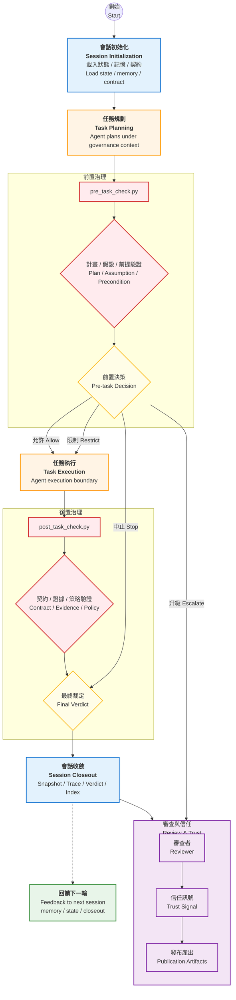
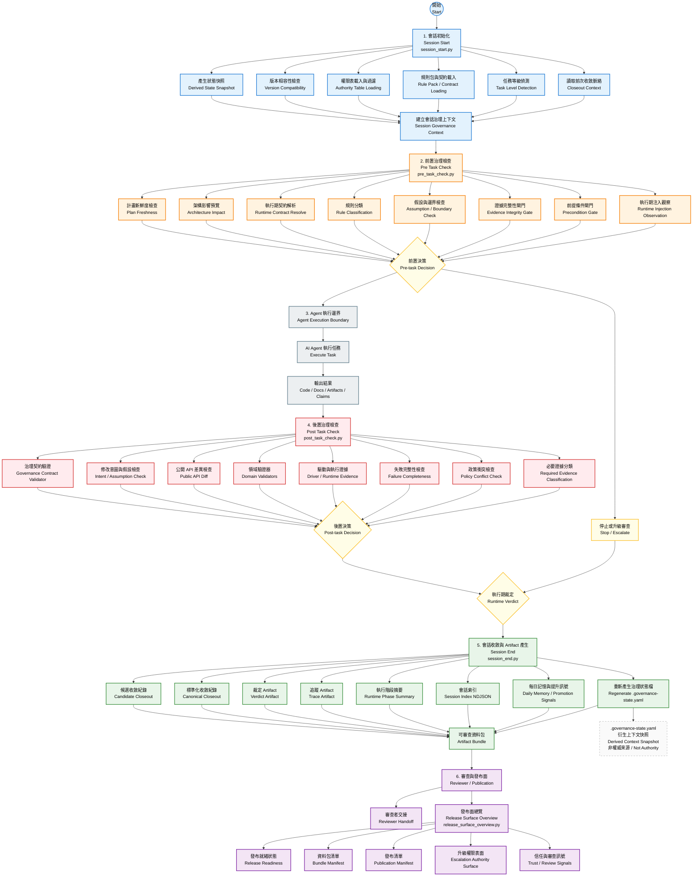

# 🚀 AI Governance Framework

讓 AI 任務變得 **可追蹤、可審核、可交接** 的治理框架。

## 🔍 這個 Repo 解決什麼問題？
當 AI / Agent 幫你執行任務時，常見問題：

- 不知道 AI 實際做了哪些步驟
- 不知道輸出是否有足夠證據支撐
- reviewer 之間缺少一致判斷基準
- 任務交接時容易遺失背景與限制
- 多 repo 導入 AI 後缺乏一致治理標準

👉 這個框架解決的不是「AI 會不會錯」  
👉 而是：

**當 AI 完成任務後，我們是否有足夠證據讓人類做判斷？**

## 💡 一句話說明
這是一個位於「AI 執行」與「人類決策」之間的治理層（governance layer），
負責產生可供審核的證據與狀態。

## 🧠 核心定位

👉 本框架 **不做決策**  
👉 它提供 **讓人做決策的材料**

## ⚙️ 核心流程（完整治理流程）





## 📦 你會得到什麼輸出？

```json
{
  "decision_usage_allowed": false,
  "analysis_safe_for_decision": false,
  "token_observability_level": "step_level",
  "token_source_summary": "mixed(provider, estimated)",
  "provenance_warning": "mixed_sources"
}
```

解讀：
- `decision_usage_allowed = false`  
  → 禁止自動決策使用
- `analysis_safe_for_decision = false`  
  → 證據不足以支持決策
- `token_*`  
  → 觀測用途（debug / visibility），不是品質

## ⚠️ Misuse Boundary（不可誤用）

本框架為 `non-authoritative`（非權威）設計。

❌ 不可用於：

- 自動封鎖（gating）
- 評分 / 排序（scoring / ranking）
- production decision logic
- 自動判定成功 / 失敗

👉 `Evidence ≠ Decision`

## 🧩 架構分層

治理執行以 Session Gate（pre/post）為核心，Token 與 Trust 相關輸出皆為 non-authoritative reviewer context，不可直接進入自動決策。

## 🧪 最小使用流程

安裝：

```bash
pip install -r requirements.txt
```

quickstart：

```bash
python governance_tools/quickstart_smoke.py \
  --project-root . \
  --plan PLAN.md \
  --contract examples/usb-hub-contract/contract.yaml \
  --format human
```

👉 會：

- 模擬治理流程
- 執行 hooks
- 產生 evidence
- 輸出 reviewer surface

檢查治理狀態：

```bash
python governance_tools/governance_drift_checker.py --repo . --framework-root .
```

## 📈 Adoption Path

### 🔧 導入到其他 Repo

```bash
python governance_tools/adopt_governance.py --target /path/to/repo
```

## 📁 核心目錄

- Runtime Hooks  
  `session_start / pre_task_check / post_task_check / session_end`
- Governance Tools  
  `adoption / drift / readiness`
- Governance  
  `contracts / rules / architecture`
- Reviewer Surface  
  `status / trust / handoff`

## 🧪 Experimental（實驗性）

Cross-repo token slice：

- 僅用於 observability
- 非 production 保證
- 非 decision-safe

## ❌ 這個 Repo 不是

- 決策引擎
- 測試替代品
- correctness proof
- orchestration system

