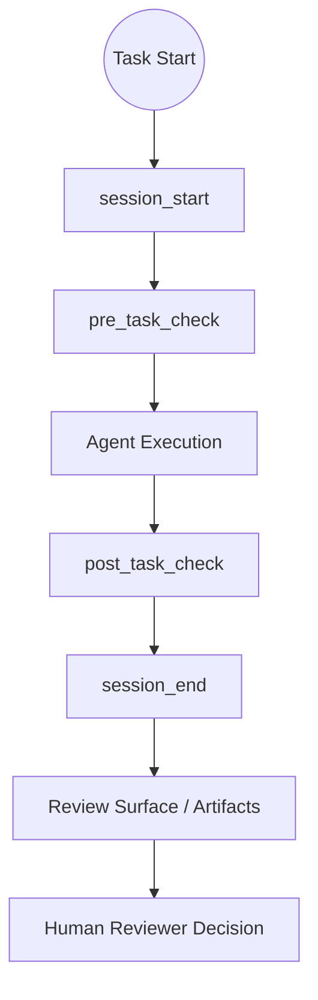

# AI Governance Framework

把 AI Coding 任務從「黑箱輸出」變成「可驗證流程」的治理框架。

當你用 Claude / Cursor / Copilot 讓 AI 幫你改程式時，最常見的問題不是「它有沒有產生結果」，而是：
- 結果是否符合專案規則
- 過程是否留有可審核證據
- reviewer 是否能一致判斷可不可以接受

這個 repo 的角色是：
**在 AI 執行與人類決策之間，提供可機器讀取的治理層。**

---

## 1) What It Does

它會在每次任務生命週期中提供四件事：
1. 任務開始前建立治理上下文（session / contract / policy）
2. 任務執行前後做檢查（pre/post task checks）
3. 產生可追蹤證據（artifact / trace / summary）
4. 產生 reviewer 可讀的交接與狀態面



---

## 2) Quick Start（2 分鐘）

### 安裝
```bash
pip install -r requirements.txt
```

### 跑最小 smoke
```bash
python governance_tools/quickstart_smoke.py --project-root . --plan PLAN.md --contract examples/usb-hub-contract/contract.yaml --format human
```

### 你會看到什麼（預期）
- 基本治理流程可執行
- session/task 檢查可完成
- 有可讀的治理輸出（非空）

### 驗證治理是否漂移
```bash
python governance_tools/governance_drift_checker.py --repo . --framework-root .
```

---

## 3) Example Output（你真正拿來判讀的資料）

```json
{
  "decision_usage_allowed": false,
  "analysis_safe_for_decision": false,
  "token_observability_level": "step_level",
  "token_source_summary": "mixed(provider, estimated)",
  "provenance_warning": "mixed_sources"
}
```

解讀：
- `decision_usage_allowed=false`：不可直接用於自動決策
- `analysis_safe_for_decision=false`：此分析不是決策授權
- `token_*`：觀測用途（可見度/追蹤），不是品質分數

---

## 4) Use Cases / Not For

### 適用
- 想把 AI 產出納入可審核流程的團隊
- 多 repo 想共用治理基線（adoption / drift / readiness）
- 需要 reviewer handoff 與證據鏈的工程流程

### 不適用
- 想要「自動幫你下決策」的系統
- 想拿它當 correctness proof 或 full regression 替代品
- 想用 token 訊號直接做 gating/scoring/ranking

---

## 5) Adopt To Your Repo

```bash
python governance_tools/adopt_governance.py --target /path/to/your/repo
```

常用配套：
- [examples/starter-pack/](examples/starter-pack/)
- [governance_tools/upgrade_starter_pack.py](governance_tools/upgrade_starter_pack.py)
- [docs/consuming-repo-adoption-checklist.md](docs/consuming-repo-adoption-checklist.md)

---

## 6) Architecture Deep Dive

### Runtime Hooks
- [runtime_hooks/core/session_start.py](runtime_hooks/core/session_start.py)
- [runtime_hooks/core/pre_task_check.py](runtime_hooks/core/pre_task_check.py)
- [runtime_hooks/core/post_task_check.py](runtime_hooks/core/post_task_check.py)
- [runtime_hooks/core/session_end.py](runtime_hooks/core/session_end.py)

### Governance Tools
- [governance_tools/adopt_governance.py](governance_tools/adopt_governance.py)
- [governance_tools/governance_drift_checker.py](governance_tools/governance_drift_checker.py)
- [governance_tools/external_repo_readiness.py](governance_tools/external_repo_readiness.py)
- [governance_tools/upgrade_starter_pack.py](governance_tools/upgrade_starter_pack.py)

### Canonical Source
- [governance/AGENT.md](governance/AGENT.md)
- [governance/SYSTEM_PROMPT.md](governance/SYSTEM_PROMPT.md)
- [governance/TESTING.md](governance/TESTING.md)
- [governance/ARCHITECTURE.md](governance/ARCHITECTURE.md)
- [governance/RULE_REGISTRY.md](governance/RULE_REGISTRY.md)

### Reviewer Surface
- [docs/status/README.md](docs/status/README.md)
- [docs/status/runtime-governance-status.md](docs/status/runtime-governance-status.md)
- [docs/status/trust-signal-dashboard.md](docs/status/trust-signal-dashboard.md)
- [docs/status/reviewer-handoff.md](docs/status/reviewer-handoff.md)

---

## 7) Limitations / Non-claims

本框架目前**不宣稱**：
- full regression coverage
- token correctness guarantee
- production readiness guarantee
- automated misuse enforcement
- runtime decision safety authorization

---

## 8) Token Controlled Slice（目前狀態）

Status: closed for current controlled slice

已建立：
- cross-repo distribution slice evidence
- interpretation guard
- citation requirement
- documented misuse scenarios

重開條件：
- 新 repo 納入
- token contract 變更
- citation/misuse wording 變更
- sentinel run 偵測到 drift

參考：
- [docs/payload-audit/token-cross-repo-summary-2026-05-05.md](docs/payload-audit/token-cross-repo-summary-2026-05-05.md)
- [docs/payload-audit/token-cross-repo-index-2026-05-06.md](docs/payload-audit/token-cross-repo-index-2026-05-06.md)
- [docs/payload-audit/token-observability-misuse-scenarios-v0.1.md](docs/payload-audit/token-observability-misuse-scenarios-v0.1.md)

---

## 9) Versioning

- 稳定發布資訊請以 [CHANGELOG.md](CHANGELOG.md) 為準。
- `main` 可能包含尚未標記 release 的最新治理改進。

---

## 10) Contributing / License

- License: [Apache 2.0](LICENSE)
- Releases: [docs/releases/README.md](docs/releases/README.md)
